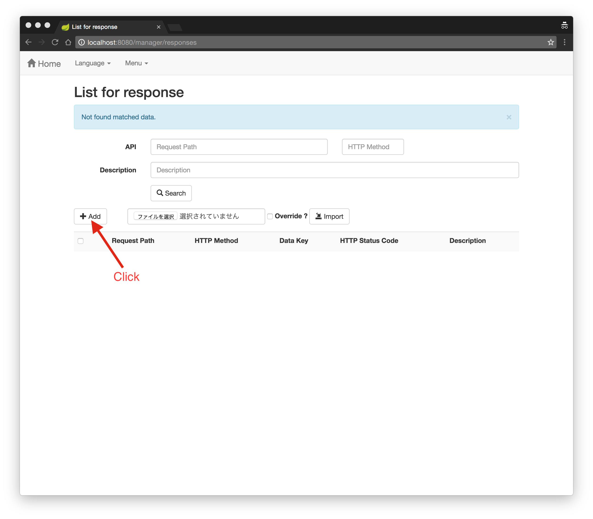
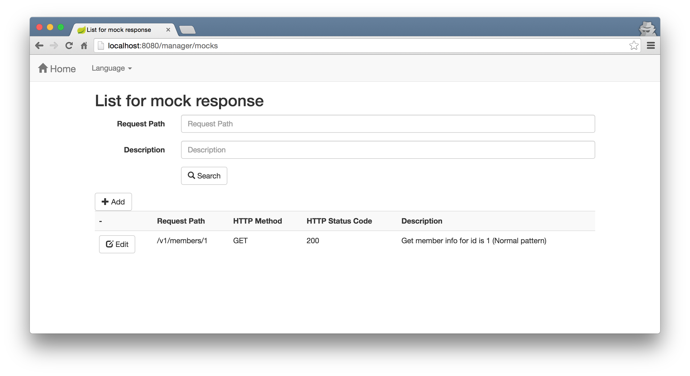
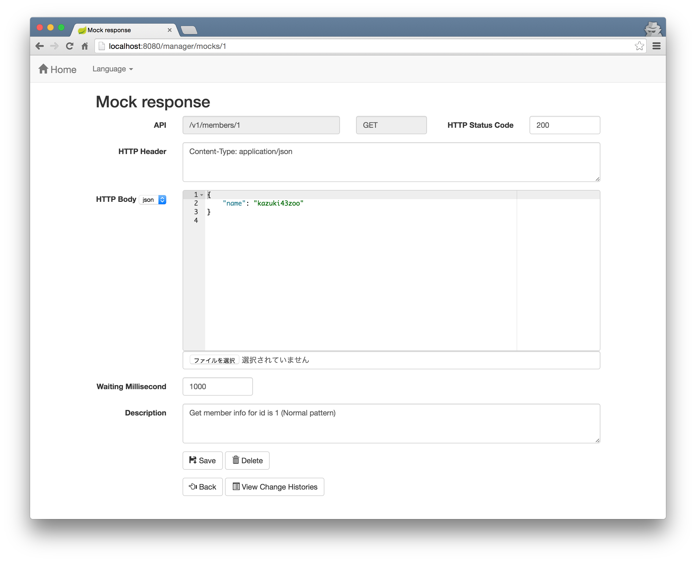

# api-stub
Stub for API

* [日本語](./README_ja.md)

## Build

```bash
$ ./mvnw clean install
```

## Run application

```bash
$ java -jar api-stub-app/target/api-stub.jar
```

> **Note**
> 
> Default server port is `8080`.

## Stop application

Type "Ctrl + C"

## How to change server port

If you want to change server port, please run application as follow (adding `--server.port=xxxx`):

e.g.)

```bash
java -jar api-stub.jar --server.port=9999
```

## How to use

### How to access the management screen for mock response data

[http://localhost:8080/](http://localhost:8080/)



#### Add a new mock response


#### Edit a new mock response






### How to access mock API

```bash
$ curl -D - http://localhost:8080/api/v1/members
HTTP/1.1 200 OK
Server: Apache-Coyote/1.1
x-correlation-id: f8b9eab7-b18a-4713-8910-88ad719ccb86
Content-Length: 0
Date: Thu, 30 Jun 2016 04:03:06 GMT

```

## Evidence

Evicence(request headers, request parameters, request body and upload files) are outouting the `evidence` directory on your application root.

```text
${APP_ROOT}/evidence
└─api
    └─v1
        └─members (* request path)
            └─GET (* http method)
                └─20160630151351369_dbf5d14d-179c-418d-8c25-ad3e55fefe37 (* ${datetime}_${x-correlation-id})
                    + request.json (* include http headers, request parameters)
                    + body.txt (* request body)
                    + uploadFile_01_xxxx.png (* upload files)
```

You can disable outputing evidence as follow:

```properties
# Disable request header, request parameter, request body
api.evidence.disabled-request=true
# Disable upload files
api.evidence.disabled-upload=true
```

## Console logs

```text
...
2016-06-30 15:09:48.555  INFO 2372 --- [nio-8080-exec-6] GET /api/v1/members                      : Start.
2016-06-30 15:09:48.555  INFO 2372 --- [nio-8080-exec-6] GET /api/v1/members                      : Evidence Dir : D:\Users\xxx\git\api-stub\evidence\api\v1\members\GET\20160630150948555_878abb0d-4828-479f-83cf-3003ae257414
2016-06-30 15:09:48.633  INFO 2372 --- [nio-8080-exec-6] GET /api/v1/members                      : Request      : {"parameters":{},"headers":{"host":["localhost:8080"],"user-agent":["curl/7.46.0"],"accept":["*/*"]}}
2016-06-30 15:09:48.664  INFO 2372 --- [nio-8080-exec-6] GET /api/v1/members                      : Response     : {"httpStatus":"OK","headers":{"x-correlation-id":["878abb0d-4828-479f-83cf-3003ae257414"]}}
2016-06-30 15:09:48.664  WARN 2372 --- [nio-8080-exec-6] GET /api/v1/members                      : Mock Response is not found.
2016-06-30 15:09:48.664  INFO 2372 --- [nio-8080-exec-6] GET /api/v1/members                      : End.
...
```

## Access the database

You can access the database dilectlly.

### Using H2 admin console

[http://localhost:8080/h2-console/](http://localhost:8080/h2-console/)

| Item | Value |
| ---- | ----- |
| Driver Class | `org.h2.Driver` |
| JDBC URL | `jdbc:h2:~/db/api-stub` |
| User Name | `sa` |
| Password | |

### Using JDBC Driver

Please download jdbc driver on [here](http://repo2.maven.org/maven2/com/h2database/h2/1.4.191/h2-1.4.191.jar).

| Item | Value |
| ---- | ----- |
| Driver Class | `org.h2.Driver` |
| JDBC URL | `jdbc:h2:tcp://localhost:9092/~/db/api-stub` |
| User | `sa` |
| Password | |


## Appendix

### Install api-stub-core into your application

Install the `api-stub-core` into local repository. (**Important**)

```bash
$ cd {api-stub-dir}
$ ./mvnw clean install
```

Add the `api-stub-core` into your pom file as follow:

```xml
<dependency>
    <groupId>com.kazuki43zoo</groupId>
    <artifactId>api-stub-core</artifactId>
    <version>1.0.0-SNAPSHOT</version>
</dependency>
```

## Known Issues

https://github.com/kazuki43zoo/api-stub/issues

## Feature request and bug report

https://github.com/kazuki43zoo/api-stub/issues/new

